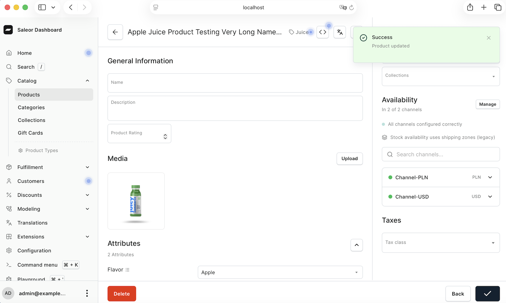
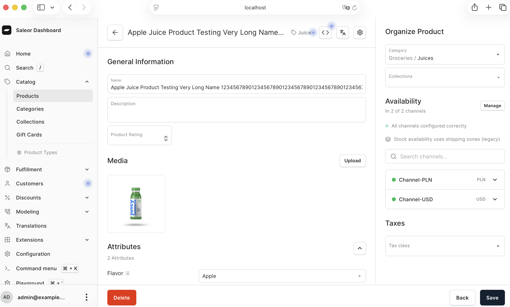

# Bug #66 – Product Update Shows Success When Required Name Field Is Empty

## Summary

During exploratory testing of the Product Catalog workflow, a validation issue was identified when editing an existing product. The required Name field can be cleared and the Save action still displays a "Success – Product updated" notification.

However, after refreshing the page, the original product name reappears, indicating that the empty value was not actually persisted.

## Steps to Reproduce

1. Open the Saleor Dashboard.
2. Navigate to Catalog > Products.
3. Open an existing product.
4. Clear all text from the Name field.
5. Click Save.
6. Observe the "Success – Product updated" notification.
7. Refresh the page.

## Expected Result

The product should not be saved when the required Name field is empty. The interface should display a validation message indicating that the Name field is required.

## Actual Result

The interface displays a successful update notification even though the Name field is empty. After refreshing the page, the original product name is restored.

## Evidence

### Empty Name Field with Success Notification

### Product Name Restored After Refresh

## Status

Defect reproduced and documented during exploratory testing.
